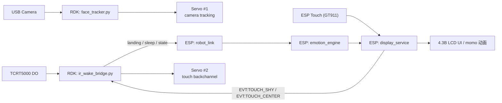

# 系统架构说明

这份文档描述 `rdk-desktop-robot` 当前版本的整体架构，包括：

- ESP32-S3 屏幕固件
- RDK X5 侧脚本
- 红外、摄像头、双舵机
- 串口双向通信

## 1. 总览

项目由两部分组成：

1. `ESP32-S3-Touch-LCD-4.3B` 屏幕固件
2. `RDK X5` 侧控制脚本

屏幕端主要负责：

- 表情渲染
- 触摸交互
- 小人降落动画
- 接收 RDK 下发状态
- 向 RDK 回发触摸事件

RDK 端主要负责：

- 红外检测
- USB 摄像头人脸跟随
- 两个连续旋转舵机控制
- 与屏幕双向串口通信

## 2. 架构图



## 3. 目录分层

### 3.1 ESP 端

- `main/`
  主入口
- `components/bsp/`
  板级初始化
- `components/robot_link/`
  串口输入层
- `components/emotion/`
  状态机层
- `components/display/`
  屏幕、触摸、动画、回传事件

### 3.2 RDK 端

- `rdk/face_tracker.py`
  摄像头人脸跟随主程序
- `rdk/camera.py`
  `face_tracker.py` 的兼容入口
- `rdk/servo_control.py`
  舵机 PWM 控制/校准工具
- `rdk/ir_wake_bridge.py`
  红外桥接 + 屏幕触摸回传事件处理
- `rdk/*.json`
  运行参数配置

## 4. ESP 端内部结构

### 4.1 主循环

入口文件：

- `main/app_main.c`

主循环顺序是：

1. `bsp_board_init()`
2. `display_service_init()`
3. `emotion_engine_init()`
4. `robot_link_init()`
5. 周期执行：
   - `robot_link_poll()`
   - `emotion_engine_request_state()`
   - `emotion_engine_update()`
   - `display_service_render()`

### 4.2 robot_link

位置：

- `components/robot_link/robot_link.c`

职责：

- 从 `USB Serial JTAG` 和 `UART0` 读取上行文本命令
- 解析为 `robot_state_t`

当前主要支持：

- `idle`
- `listening`
- `landing`
- `wake`
- `processing`
- `speaking`
- `happy`
- `sleep`
- `error`

其中：

- `landing / wake / trigger`
  会统一映射到 `ROBOT_STATE_LANDING`

### 4.3 emotion_engine

位置：

- `components/emotion/emotion_engine.c`

职责：

- 作为显示层与输入层之间的轻量状态机
- 提供当前稳定状态

### 4.4 display_service

位置：

- `components/display/display_service.c`

职责：

- 初始化 LCD 与 GT911
- 管理表情 UI
- 管理 `momo` 降落动画
- 管理触摸区判定
- 向 RDK 回发触摸事件

当前触摸映射：

- 左上：左看
- 中上：害羞
- 右上：右看
- 左中：监听
- 中中：回到中间
- 右中：处理中
- 左下：眨眼
- 中下：说话
- 右下：睡眠

回传给 RDK 的触摸事件：

- `EVT:TOUCH_SHY`
- `EVT:TOUCH_CENTER`

## 5. RDK 端内部结构

### 5.1 摄像头跟随

位置：

- `rdk/face_tracker.py`

职责：

- 打开 `/dev/video*`
- 用 OpenCV 做人脸检测
- 根据脸中心偏移决定左右转动
- 驱动舵机 1

依赖：

- `rdk/servo_control.py`
- `rdk/tracker_config.json`

默认舵机 1：

- `pin 33`

### 5.2 红外桥接

位置：

- `rdk/ir_wake_bridge.py`

职责：

- 读取 TCRT5000 的 `DO`
- 向屏幕发 `landing / sleep`
- 同时监听屏幕端回发事件
- 驱动舵机 2

依赖：

- `rdk/servo_control.py`
- `rdk/ir_wake_config.json`

默认舵机 2：

- `pin 32`

## 6. 双向串口协议

### 6.1 正向：RDK -> ESP

通过同一根 `Type-C` 串口给屏幕发送状态：

```text
landing
sleep
listening
processing
speaking
happy
idle
error
```

### 6.2 反向：ESP -> RDK

屏幕触摸时给 RDK 回发：

```text
EVT:TOUCH_SHY
EVT:TOUCH_CENTER
```

### 6.3 为什么不会冲突

当前设计里：

- 同一个 `ir_wake_bridge.py` 进程独占串口
- 同时负责：
  - 发红外命令给屏幕
  - 收屏幕回发事件

因此不会出现两个进程同时抢 `/dev/ttyACM*` 的问题。

## 7. 双舵机职责划分

### 舵机 1

- 用途：摄像头人脸跟随
- 默认引脚：`pin 33`
- 控制者：`face_tracker.py`

### 舵机 2

- 用途：触摸中上部害羞低头 / 中间回中抬头
- 默认引脚：`pin 32`
- 控制者：`ir_wake_bridge.py`

## 8. 当前已知限制

### 8.1 舵机 2 是连续旋转舵机

因此：

- 只能做“短脉冲近似位移”
- 不能像角度舵机一样精确回到绝对角度

也就是说：

- `TOUCH_SHY`
  是“向下动一点”
- `TOUCH_CENTER`
  是“往回拨一点”

### 8.2 USB 稳定性仍然是系统级风险

如果 RDK 侧出现以下日志：

- `USB disconnect`
- `disabled by hub (EMI?)`
- `error -71`

优先排查：

- Type-C 数据线
- USB Hub
- 供电

### 8.3 红外与第二舵机的相互干扰

第二个舵机动作时可能会让红外输入抖动，所以 `ir_wake_bridge.py` 里已经加入：

- `sensor_ignore_after_touch_servo_seconds`

用于短时间忽略触摸舵机动作后的红外变化。

## 9. 推荐阅读顺序

如果你是第一次接手这个项目，建议按这个顺序看：

1. [README.md](/Users/yirran/Downloads/rdx_camera_红外版/emoji_on_esp32s3_touch_lcd_4.3B-main/README.md)
2. [JOINT_DEBUG.md](/Users/yirran/Downloads/rdx_camera_红外版/emoji_on_esp32s3_touch_lcd_4.3B-main/docs/JOINT_DEBUG.md)
3. `main/app_main.c`
4. `components/robot_link/robot_link.c`
5. `components/emotion/emotion_engine.c`
6. `components/display/display_service.c`
7. `rdk/face_tracker.py`
8. `rdk/ir_wake_bridge.py`
9. `rdk/servo_control.py`
